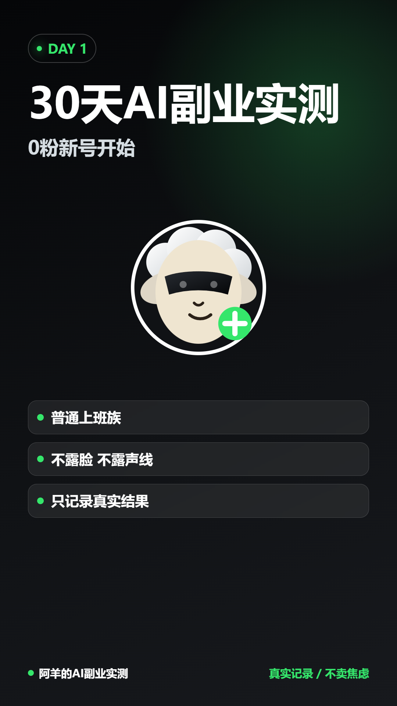

# 阿羊的 AI 实战作品集

这是 Codex 训练营第 1-2 课的练习项目：把一句模糊需求“做一个个人作品展示网页”，落地成一个可以打开、可以继续修改、后续可以发布到 GitHub Pages 的静态网页。

## 项目内容

页面展示了三条当前主线：

- 本地商家 AI 内容助手
- 阿羊 AI 实测号
- Codex 个人工作流训练营

## 文件结构

```text
ai-portfolio-lesson1/
├─ index.html
├─ README.md
└─ assets/
   └─ cover.png
```

## 本地打开

直接双击 `index.html`，或用浏览器打开：

```text
ai-portfolio-lesson1/index.html
```

## 为什么要有 assets 文件夹

上一版页面引用的是电脑上其他目录里的图片。这样本机能看，但上传到 GitHub 后图片会丢失。

现在图片已经放进 `assets/cover.png`，网页使用相对路径：

```html

```

这样整个文件夹可以作为一个完整项目移动、压缩、上传或发布。

## 后续 GitHub Pages 发布思路

1. 安装 Git for Windows。
2. 注册或登录 GitHub。
3. 新建一个仓库，例如 `ai-portfolio`.
4. 把本文件夹内容上传到仓库。
5. 在仓库设置里开启 GitHub Pages。
6. 获得一个可公开访问的网址。

## 下一步练习

- 修改页面文案，让它更像你的个人主页。
- 增加第二张作品图。
- 把 CSS 拆成单独文件。
- 安装 Git，学习 `git init`、`git add`、`git commit`。
